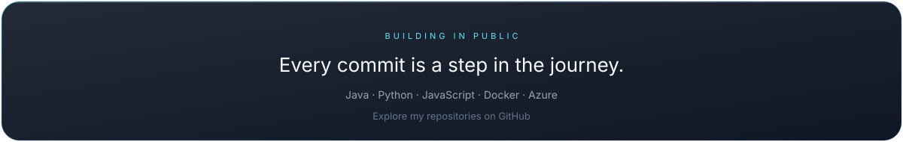
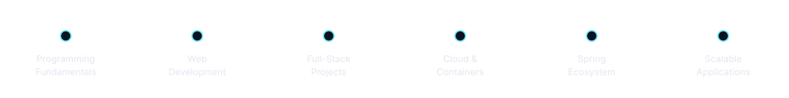

 

Full-Stack Developer · Java Full Stack Enthusiast · Python Full Stack Developer

  

PHILOSOPHY

### I don't just write code.
### I design systems, solve real problems, and build software that lasts.

ENGINEERING FOCUS

 

  

TECHNOLOGY ARSENAL

 

  

WORKFLOW

 

 

DEVELOPER JOURNEY

 

BEYOND CODING

 

Problem solving · Continuous learning · Building useful products · Exploring modern technologies

  

> Great software is not built by writing more code.  
> It is built by solving the right problems with clarity and intent.

CONNECT

 

  

Build with intent. Engineer with elegance. Deliver with impact.

