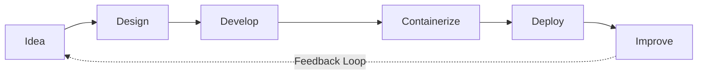

<div align="center">


<br/>


<br/><br/>


</div>

---


## Developer Philosophy

```text
I don't just write code.
I design systems, solve real problems,
and build software that lasts.
```

- **Architecture-first thinking**
- **Clean, maintainable implementation**
- **Continuous learning and iteration**
- **Modern engineering practices from dev to deployment**


## Engineering Focus

<table>
<tr>
<td width="50%" valign="top">

### Current Interests
- Full-Stack Development  
- Backend Engineering  
- Cloud Technologies  
- Containerized Applications  

</td>
<td width="50%" valign="top">

### Learning Journey
- Spring Framework  
- Spring Boot  
- Scalable System Design  

</td>
</tr>
</table>


## Technology Arsenal

<div align="center">


</div>


## Development Workflow




## Highlighted Projects

> Replace the placeholders below with your best repositories.

- **[PROJECT_01_NAME](https://github.com/pramdevgan01/PROJECT_01_REPO)**  
  `One-line impact statement about what problem it solves.`

- **[PROJECT_02_NAME](https://github.com/pramdevgan01/PROJECT_02_REPO)**  
  `One-line impact statement about architecture / scale / usefulness.`

- **[PROJECT_03_NAME](https://github.com/pramdevgan01/PROJECT_03_REPO)**  
  `One-line impact statement about tech depth and outcomes.`


## Open Source & Collaboration

I am open to collaborating on:
- Open source projects  
- Startup/product ideas  
- Developer communities  
- Learning and mentoring initiatives  
- Technical architecture discussions  


## GitHub Insights

<div align="center">


<br/>


</div>


## Developer Journey


## Beyond Coding

- Problem solving with product thinking  
- Building useful software with practical impact  
- Learning modern technologies and architecture patterns  
- Improving developer experience and code quality


## Signature

> **"Great software is not built by writing more code.  
> It is built by solving the right problems with clarity and intent."**


## Connect

<div align="center">

<a href="https://www.linkedin.com/in/pramatmavishwakarma/"></a>
<a href="mailto:code.pramv@gmail.com"></a>

</div>


<div align="center">

**Build with intent. Engineer with elegance. Deliver with impact.**

</div>
